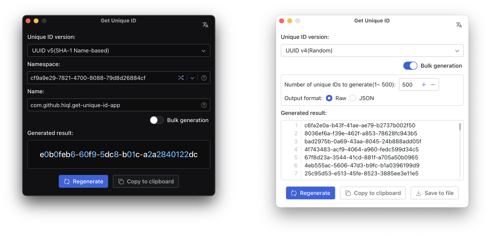

# Get Unique ID

Generates unique IDs(UUID/CUID/ULID/NanoID/ObjectID/Snowflake, etc) for you to use in debugging, development, or anywhere else you may need a unique ID.

## Supported ID Formats
- UUID v1(Gregorian Time-based)
- UUID v3(MD5 Name-based)
- UUID v4(Random)
- UUID v5(SHA-1 Name-based)
- UUID v6(Reordered Gregorian Time-based)
- UUID v7(Unix Time-based)
- Short UUID
- Nil UUID
- Max UUID
- ULID
- UPID
- CUID
- CUID2
- Nano ID
- NUID
- TSID
- SCRU128
- Snowflake
- Sonyflake
- Object ID

## License

MIT